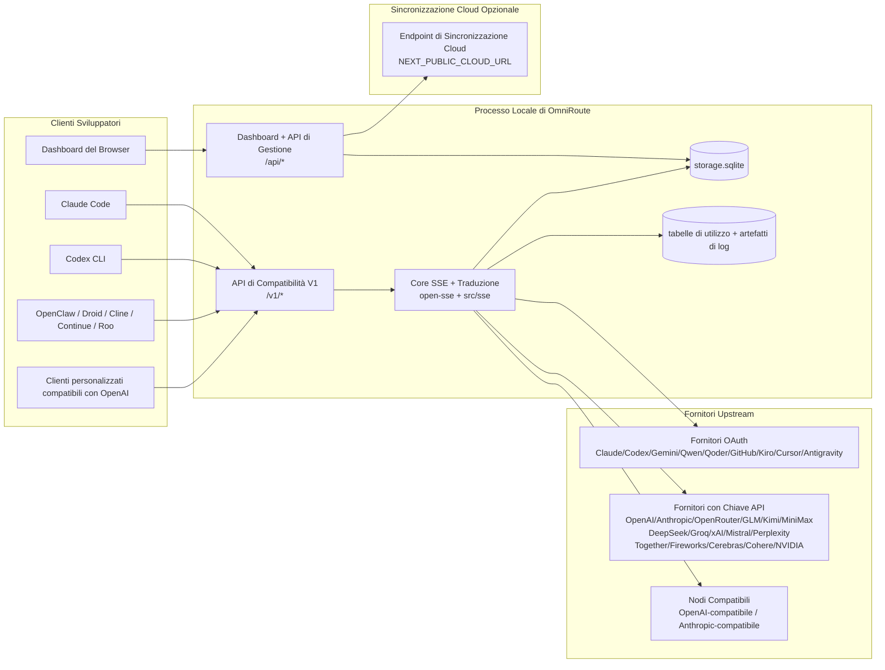
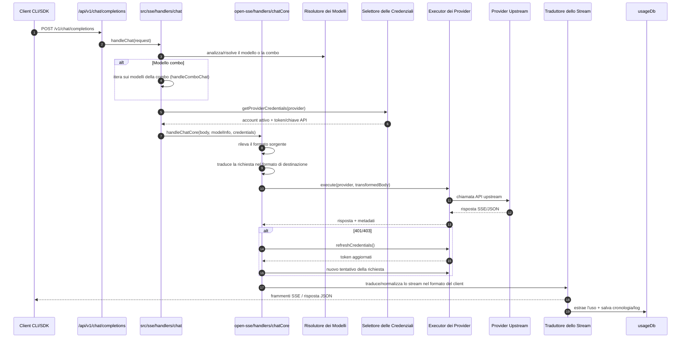
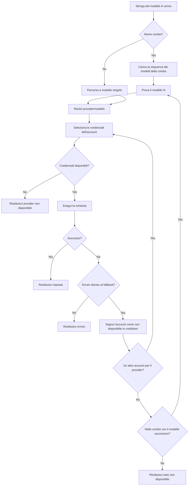
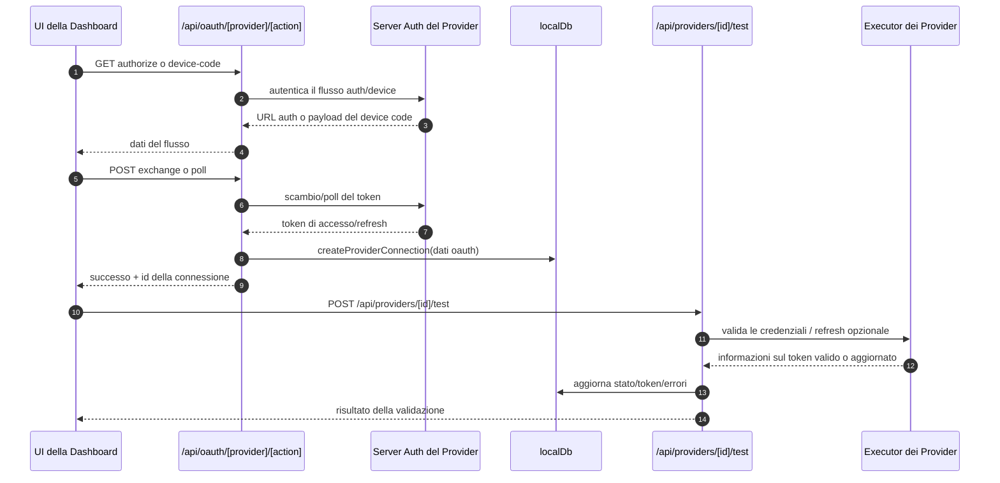
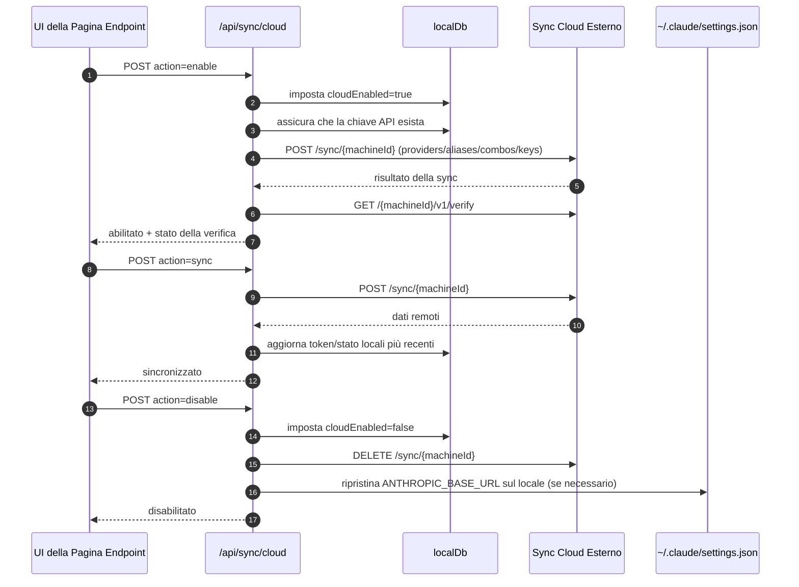
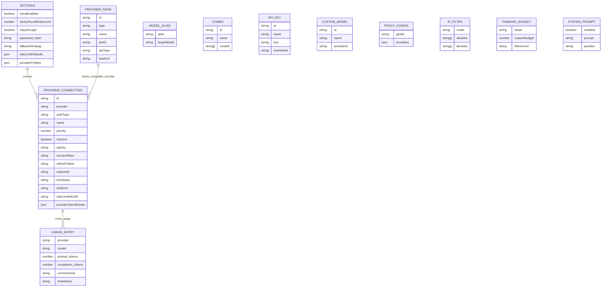
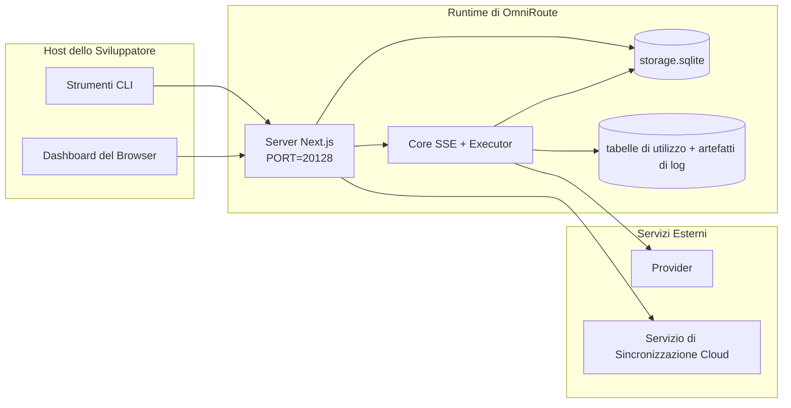

# OmniRoute Architecture (Italiano)

🌐 **Languages:** 🇺🇸 [English](../../../../docs/ARCHITECTURE.md) · 🇸🇦 [ar](../../ar/docs/ARCHITECTURE.md) · 🇧🇬 [bg](../../bg/docs/ARCHITECTURE.md) · 🇧🇩 [bn](../../bn/docs/ARCHITECTURE.md) · 🇨🇿 [cs](../../cs/docs/ARCHITECTURE.md) · 🇩🇰 [da](../../da/docs/ARCHITECTURE.md) · 🇩🇪 [de](../../de/docs/ARCHITECTURE.md) · 🇪🇸 [es](../../es/docs/ARCHITECTURE.md) · 🇮🇷 [fa](../../fa/docs/ARCHITECTURE.md) · 🇫🇮 [fi](../../fi/docs/ARCHITECTURE.md) · 🇫🇷 [fr](../../fr/docs/ARCHITECTURE.md) · 🇮🇳 [gu](../../gu/docs/ARCHITECTURE.md) · 🇮🇱 [he](../../he/docs/ARCHITECTURE.md) · 🇮🇳 [hi](../../hi/docs/ARCHITECTURE.md) · 🇭🇺 [hu](../../hu/docs/ARCHITECTURE.md) · 🇮🇩 [id](../../id/docs/ARCHITECTURE.md) · 🇮🇹 [it](../../it/docs/ARCHITECTURE.md) · 🇯🇵 [ja](../../ja/docs/ARCHITECTURE.md) · 🇰🇷 [ko](../../ko/docs/ARCHITECTURE.md) · 🇮🇳 [mr](../../mr/docs/ARCHITECTURE.md) · 🇲🇾 [ms](../../ms/docs/ARCHITECTURE.md) · 🇳🇱 [nl](../../nl/docs/ARCHITECTURE.md) · 🇳🇴 [no](../../no/docs/ARCHITECTURE.md) · 🇵🇭 [phi](../../phi/docs/ARCHITECTURE.md) · 🇵🇱 [pl](../../pl/docs/ARCHITECTURE.md) · 🇵🇹 [pt](../../pt/docs/ARCHITECTURE.md) · 🇧🇷 [pt-BR](../../pt-BR/docs/ARCHITECTURE.md) · 🇷🇴 [ro](../../ro/docs/ARCHITECTURE.md) · 🇷🇺 [ru](../../ru/docs/ARCHITECTURE.md) · 🇸🇰 [sk](../../sk/docs/ARCHITECTURE.md) · 🇸🇪 [sv](../../sv/docs/ARCHITECTURE.md) · 🇰🇪 [sw](../../sw/docs/ARCHITECTURE.md) · 🇮🇳 [ta](../../ta/docs/ARCHITECTURE.md) · 🇮🇳 [te](../../te/docs/ARCHITECTURE.md) · 🇹🇭 [th](../../th/docs/ARCHITECTURE.md) · 🇹🇷 [tr](../../tr/docs/ARCHITECTURE.md) · 🇺🇦 [uk-UA](../../uk-UA/docs/ARCHITECTURE.md) · 🇵🇰 [ur](../../ur/docs/ARCHITECTURE.md) · 🇻🇳 [vi](../../vi/docs/ARCHITECTURE.md) · 🇨🇳 [zh-CN](../../zh-CN/docs/ARCHITECTURE.md)

---

_Last updated: 2026-04-15_

## Riepilogo Esecutivo

OmniRoute è un gateway di routing AI locale e dashboard costruito su Next.js.
Fornisce un unico endpoint compatibile con OpenAI (`/v1/*`) e instrada il traffico attraverso molteplici fornitori upstream con traduzione, fallback, aggiornamento dei token e tracciamento dell'utilizzo.

Funzionalità principali:

- Superficie API compatibile con OpenAI per CLI/strumenti (100+ fornitori, 16 executor)
- Traduzione richiesta/risposta tra i formati dei fornitori
- Fallback con combinazioni di modelli (sequenza multi-modello)
- Passi di combo strutturati (`fornitore + modello + connessione`) con ordinamento runtime tramite `compositeTiers`
- Fallback a livello di account (più account per fornitore)
- Preflight di quota e selezione account P2C consapevole della quota nel percorso chat principale
- Gestione delle connessioni dei fornitori OAuth + chiave API (13 moduli OAuth)
- Generazione di embedding tramite `/v1/embeddings` (6 fornitori, 9 modelli)
- Generazione di immagini tramite `/v1/images/generations` (10+ fornitori, 20+ modelli)
- Trascrizione audio tramite `/v1/audio/transcriptions` (7 fornitori)
- Sintesi vocale tramite `/v1/audio/speech` (10 fornitori)
- Generazione video tramite `/v1/videos/generations` (ComfyUI + SD WebUI)
- Generazione musicale tramite `/v1/music/generations` (ComfyUI)
- Ricerca web tramite `/v1/search` (5 fornitori)
- Moderazioni tramite `/v1/moderations`
- Riordinamento (reranking) tramite `/v1/rerank`
- Parsing dei tag del pensiero (`<think>...</think>`) per i modelli di ragionamento
- Sanitizzazione delle risposte per una compatibilità rigorosa con l'SDK OpenAI
- Normalizzazione dei ruoli (developer→system, system→user) per la compatibilità tra fornitori
- Conversione dell'output strutturato (json_schema → Gemini responseSchema)
- Persistenza locale per fornitori, chiavi, alias, combo, impostazioni, prezzi (26 moduli DB)
- Tracciamento di utilizzo/costi e registrazione delle richieste
- Sincronizzazione cloud opzionale per la sincronizzazione multi-dispositivo/stato
- Allowlist/blocklist IP per il controllo dell'accesso API
- Gestione del budget del pensiero (passthrough/auto/custom/adaptive)
- Iniezione di un prompt di sistema globale
- Tracciamento delle sessioni e fingerprinting
- Rate limiting per singolo account con profili specifici del fornitore
- Schema del circuit breaker per la resilienza dei fornitori
- Protezione anti-thundering herd con mutex locking
- Cache di deduplicazione delle richieste basata su firma
- Livello di dominio: regole di costo, policy di fallback, policy di lockout
- Context Relay: riepiloghi di handoff di sessione per la continuità della rotazione degli account
- Persistenza dello stato di dominio (cache write-through SQLite per fallback, budget, lockout, circuit breaker)
- Motore di policy per la valutazione centralizzata delle richieste (lockout → budget → fallback)
- Telemetria delle richieste con aggregazione della latenza p50/p95/p99
- Telemetria dei target combo e salute storica dei target combo tramite `combo_execution_key` / `combo_step_id`
- ID di correlazione (X-Request-Id) per il tracciamento end-to-end
- Registro di audit di conformità con opt-out per chiave API
- Framework di valutazione per l'assicurazione di qualità LLM
- Dashboard di salute con stato del circuit breaker dei fornitori in tempo reale
- MCP Server (25 strumenti) con 3 trasporti (stdio/SSE/Streamable HTTP)
- Server A2A (JSON-RPC 2.0 + SSE) con abilità e ciclo di vita dei task
- Sistema di memoria (estrazione, iniezione, recupero, riassunto)
- Sistema di abilità (registro, executor, sandbox, abilità integrate)
- Proxy MITM con gestione dei certificati e gestione DNS
- Middleware di protezione contro l'iniezione del prompt
- Registro ACP (Agent Communication Protocol)
- Fornitori OAuth modulari (13 moduli individuali sotto `src/lib/oauth/providers/`)
- Script di disinstallazione/disinstallazione completa
- Azione di riparazione dell'ambiente OAuth
- Bridge WebSocket per client WS compatibili con OpenAI (`/v1/ws`)
- Gestione dei token di sincronizzazione (emissione/revoca, download del pacchetto di configurazione ETag-versioned)
- Preset di prima classe GLM Thinking (`glmt`)
- Conteggio dei token ibrido (lato provider `/messages/count_tokens` con fallback di stima)
- Popolamento automatico degli alias di modello (30+ normalizzazioni di dialetto cross-proxy all'avvio)
- Fetch sicuro in uscita con guardia SSRF, blocco degli URL privati e retry configurabili
- Retry di chat consapevoli del cooldown con `requestRetry` e `maxRetryIntervalSec` configurabili
- Validazione dell'ambiente di runtime con Zod all'avvio
- Audit di conformità v2 con paginazione, eventi CRUD dei fornitori e registro di validazione bloccata da SSRF

Modello di runtime primario:

- Le rotte dell'app Next.js sotto `src/app/api/*` implementano sia le API di dashboard sia le API di compatibilità
- Un core SSE/routing condiviso in `src/sse/*` + `open-sse/*` gestisce l'esecuzione dei provider, la traduzione, lo streaming, il fallback e l'utilizzo

## Ambito e Confini

### In Ambito

- Runtime gateway locale
- API di gestione della dashboard
- Autenticazione dei provider e aggiornamento dei token
- Traduzione delle richieste e streaming SSE
- Stato locale + persistenza dell'utilizzo
- Orchestrazione opzionale della sincronizzazione cloud

### Fuori Ambito

- Implementazione del servizio cloud dietro `NEXT_PUBLIC_CLOUD_URL`
- SLA dei provider/piano di controllo fuori dal processo locale
- I binari CLI esterni stessi (Claude CLI, Codex CLI, ecc.)

## Superficie della Dashboard (Attuale)

Pagine principali sotto `src/app/(dashboard)/dashboard/`:

- `/dashboard` — guida rapida + panoramica dei provider
- `/dashboard/endpoint` — proxy endpoint + schede MCP + A2A + endpoint API
- `/dashboard/providers` — connessioni ai provider e credenziali
- `/dashboard/combos` — strategie combo, modelli, builder basato su passi, regole di routing dei modelli, ordinamento persistito manuale
- `/dashboard/costs` — aggregazione dei costi e visibilità dei prezzi
- `/dashboard/analytics` — analisi di utilizzo, valutazioni, salute dei target combo
- `/dashboard/limits` — controlli di quota/rate
- `/dashboard/cli-tools` — onboarding CLI, rilevamento del runtime, generazione della configurazione
- `/dashboard/agents` — agenti ACP rilevati + registrazione di agenti personalizzati
- `/dashboard/media` — playground per immagini/video/musica
- `/dashboard/search-tools` — test dei provider di ricerca e cronologia
- `/dashboard/health` — uptime, circuit breaker, limiti di rate, sessioni monitorate per quota
- `/dashboard/logs` — log di richieste/proxy/audit/console
- `/dashboard/settings` — schede delle impostazioni di sistema (generali, routing, predefiniti combo, ecc.)
- `/dashboard/api-manager` — ciclo di vita delle chiavi API e permessi dei modelli

## Contesto di Sistema ad Alto Livello



## Componenti di Runtime Principali

## 1) Livello API e Routing (Rotte dell'App Next.js)

Directory principali:

- `src/app/api/v1/*` e `src/app/api/v1beta/*` per le API di compatibilità
- `src/app/api/*` per le API di gestione/configurazione
- Il rewrites di Next in `next.config.mjs` mappa `/v1/*` a `/api/v1/*`

Rotte di compatibilità importanti:

- `src/app/api/v1/chat/completions/route.ts`
- `src/app/api/v1/messages/route.ts`
- `src/app/api/v1/responses/route.ts`
- `src/app/api/v1/models/route.ts` — include modelli personalizzati con `custom: true`
- `src/app/api/v1/embeddings/route.ts` — generazione di embedding (6 fornitori)
- `src/app/api/v1/images/generations/route.ts` — generazione di immagini (4+ fornitori incl. Antigravity/Nebius)
- `src/app/api/v1/messages/count_tokens/route.ts`
- `src/app/api/v1/providers/[provider]/chat/completions/route.ts` — chat dedicata per singolo provider
- `src/app/api/v1/providers/[provider]/embeddings/route.ts` — embedding dedicati per singolo provider
- `src/app/api/v1/providers/[provider]/images/generations/route.ts` — immagini dedicate per singolo provider
- `src/app/api/v1beta/models/route.ts`
- `src/app/api/v1beta/models/[...path]/route.ts`

Domini di gestione:

- Auth/impostazioni: `src/app/api/auth/*`, `src/app/api/settings/*`
- Provider/connessioni: `src/app/api/providers*`
- Nodi dei provider: `src/app/api/provider-nodes*`
- Modelli personalizzati: `src/app/api/provider-models` (GET/POST/DELETE)
- Catalogo modelli: `src/app/api/models/route.ts` (GET)
- Configurazione proxy: `src/app/api/settings/proxy` (GET/PUT/DELETE) + `src/app/api/settings/proxy/test` (POST)
- OAuth: `src/app/api/oauth/*`
- Chiavi/alias/combo/prezzi: `src/app/api/keys*`, `src/app/api/models/alias`, `src/app/api/combos*`, `src/app/api/pricing`
- Utilizzo: `src/app/api/usage/*`
- Sync/cloud: `src/app/api/sync/*`, `src/app/api/cloud/*`
- Helper per gli strumenti CLI: `src/app/api/cli-tools/*`
- Filtro IP: `src/app/api/settings/ip-filter` (GET/PUT)
- Budget del pensiero: `src/app/api/settings/thinking-budget` (GET/PUT)
- Prompt di sistema: `src/app/api/settings/system-prompt` (GET/PUT)
- Sessioni: `src/app/api/sessions` (GET)
- Limiti di rate: `src/app/api/rate-limits` (GET)
- Resilienza: `src/app/api/resilience` (GET/PATCH) — coda di richieste, cooldown delle connessioni, circuit breaker dei provider, configurazione wait-for-cooldown
- Reset della resilienza: `src/app/api/resilience/reset` (POST) — reset dei circuit breaker dei provider
- Statistiche cache: `src/app/api/cache/stats` (GET/DELETE)
- Telemetria: `src/app/api/telemetry/summary` (GET)
- Budget: `src/app/api/usage/budget` (GET/POST)
- Catene di fallback: `src/app/api/fallback/chains` (GET/POST/DELETE)
- Audit di conformità: `src/app/api/compliance/audit-log` (GET, con paginazione + metadati strutturali)
- Evals: `src/app/api/evals` (GET/POST), `src/app/api/evals/[suiteId]` (GET)
- Policy: `src/app/api/policies` (GET/POST)
- Token di sync: `src/app/api/sync/tokens` (GET/POST), `src/app/api/sync/tokens/[id]` (GET/DELETE)
- Configurazione bundle: `src/app/api/sync/bundle` (GET, snapshot ETag-versioned di impostazioni/provider/combos/chiavi)
- WebSocket: `src/app/api/v1/ws/route.ts` — gestore di Upgrade per client WS compatibili con OpenAI

## 2) Core SSE + Traduzione

Moduli del flusso principale:

- Punto di ingresso: `src/sse/handlers/chat.ts`
- Orchestrazione principale: `open-sse/handlers/chatCore.ts`
- Adapter di esecuzione dei provider: `open-sse/executors/*`
- Rilevamento del formato/configurazione del provider: `open-sse/services/provider.ts`
- Parse/risoluzione dei modelli: `src/sse/services/model.ts`, `open-sse/services/model.ts`
- Logica di fallback degli account: `open-sse/services/accountFallback.ts`
- Registro della traduzione: `open-sse/translator/index.ts`
- Trasformazioni dello stream: `open-sse/utils/stream.ts`, `open-sse/utils/streamHandler.ts`
- Estrazione/normalizzazione dell'uso: `open-sse/utils/usageTracking.ts`
- Parser del tag del pensiero: `open-sse/utils/thinkTagParser.ts`
- Gestore degli embedding: `open-sse/handlers/embeddings.ts`
- Registro dei provider per gli embedding: `open-sse/config/embeddingRegistry.ts`
- Gestore della generazione di immagini: `open-sse/handlers/imageGeneration.ts`
- Registro dei provider per le immagini: `open-sse/config/imageRegistry.ts`
- Sanitizzazione delle risposte: `open-sse/handlers/responseSanitizer.ts`
- Normalizzazione dei role: `open-sse/services/roleNormalizer.ts`

Servizi (logica di business):

- Selezione/punteggio degli account: `open-sse/services/accountSelector.ts`
- Gestione del ciclo di vita del contesto: `open-sse/services/contextManager.ts`
- Applicazione del filtro IP: `open-sse/services/ipFilter.ts`
- Tracciamento delle sessioni: `open-sse/services/sessionManager.ts`
- Deduplicazione delle richieste: `open-sse/services/signatureCache.ts`
- Iniezione del prompt di sistema: `open-sse/services/systemPrompt.ts`
- Gestione del budget del pensiero: `open-sse/services/thinkingBudget.ts`
- Routing dei modelli con wildcard: `open-sse/services/wildcardRouter.ts`
- Gestione dei limiti di rate: `open-sse/services/rateLimitManager.ts`
- Circuit breaker: `open-sse/services/circuitBreaker.ts`
- Handoff del contesto: `open-sse/services/contextHandoff.ts` — generazione e iniezione del riepilogo di handoff per la strategia context-relay
- Codex quota fetcher: `open-sse/services/codexQuotaFetcher.ts` — recupera la quota Codex per le decisioni di handoff context-relay
- Retry consapevole del cooldown: `src/sse/services/cooldownAwareRetry.ts` — retry del cooldown per modello con `requestRetry` / `maxRetryIntervalSec` configurabili
- Fetch sicuro in uscita: `src/shared/network/safeOutboundFetch.ts` — fetch del provider/modello guardato con protezione SSRF, blocco URL privati, retry e timeout
- Guardia degli URL in uscita: `src/shared/network/outboundUrlGuard.ts` — valida gli URL dei provider rispetto ai intervalli CIDR privati/localhost
- Predefiniti delle richieste del provider: `open-sse/services/providerRequestDefaults.ts` — predefiniti a livello provider per `maxTokens`, `temperature`, `thinkingBudgetTokens`
- Costanti del provider GLM: `open-sse/config/glmProvider.ts` — modelli GLM condivisi, URL di quota, timeout/predefiniti GLM
- Upstream Antigravity: `open-sse/config/antigravityUpstream.ts` — URL di base e costanti del percorso di discovery
- Costanti del client Codex: `open-sse/config/codexClient.ts` — valori user-agent e client-version versionati
- Seme degli alias di modello: `src/lib/modelAliasSeed.ts` — aggiunge 30+ alias di dialetto cross-proxy all'avvio

Moduli del livello di dominio:

- Regole di costo/budget: `src/lib/domain/costRules.ts`
- Policy di fallback: `src/lib/domain/fallbackPolicy.ts`
- Risolutore di combo: `src/lib/domain/comboResolver.ts`
- Policy di lockout: `src/lib/domain/lockoutPolicy.ts`
- Motore di policy: `src/domain/policyEngine.ts` — valutazione centralizzata di lockout → budget → fallback
- Catalogo dei codici di errore: `src/lib/domain/errorCodes.ts`
- ID della richiesta: `src/lib/domain/requestId.ts`
- Timeout di fetch: `src/lib/domain/fetchTimeout.ts`
- Telemetria delle richieste: `src/lib/domain/requestTelemetry.ts`
- Conformità/audit: `src/lib/domain/compliance/index.ts`
- Eval runner: `src/lib/domain/evalRunner.ts`
- Persistenza dello stato di dominio: `src/lib/db/domainState.ts` — SQLite CRUD per catene di fallback, budget, cronologia costi, stato di lockout, circuit breaker

Moduli dei provider OAuth (13 file individuali sotto `src/lib/oauth/providers/`):

- Indice del registro: `src/lib/oauth/providers/index.ts`
- Provider individuali: `claude.ts`, `codex.ts`, `gemini.ts`, `antigravity.ts`, `qoder.ts`, `qwen.ts`, `kimi-coding.ts`, `github.ts`, `kiro.ts`, `cursor.ts`, `kilocode.ts`, `cline.ts`
- Wrapper sottile: `src/lib/oauth/providers.ts` — re-export di moduli individuali

## 3) Livello di Persistenza

DB di stato principale (SQLite):

- Infrastruttura principale: `src/lib/db/core.ts` (better-sqlite3, migrazioni, WAL)
- Facciata di re-export: `src/lib/localDb.ts` (livello di compatibilità sottile per i chiamanti)
- file: `${DATA_DIR}/storage.sqlite` (oppure `$XDG_CONFIG_HOME/omniroute/storage.sqlite` quando impostato, altrimenti `~/.omniroute/storage.sqlite`)
- entità (tabelle + namespace KV): providerConnections, providerNodes, modelAliases, combos, apiKeys, settings, pricing, **customModels**, **proxyConfig**, **ipFilter**, **thinkingBudget**, **systemPrompt**

Persistenza dell'utilizzo:

- facciata: `src/lib/usageDb.ts` (moduli scomposti in `src/lib/usage/*`)
- Tabelle SQLite in `storage.sqlite`: `usage_history`, `call_logs`, `proxy_logs`
- artefatti di file opzionali rimangono per compatibilità/debug (`${DATA_DIR}/log.txt`, `${DATA_DIR}/call_logs/`, `<repo>/logs/...`)
- i file JSON legacy vengono migrati a SQLite dalle migrazioni di avvio quando presenti

DB di Stato di Dominio (SQLite):

- `src/lib/db/domainState.ts` — operazioni CRUD per lo stato di dominio
- Tabelle (create in `src/lib/db/core.ts`): `domain_fallback_chains`, `domain_budgets`, `domain_cost_history`, `domain_lockout_state`, `domain_circuit_breakers`
- Schema della cache write-through: le Map in memoria sono autorevoli in runtime; le mutazioni vengono scritte in modo sincrono su SQLite; lo stato viene ripristinato dal DB all'avvio a freddo

## 4) Superfici Auth + Sicurezza

- Auth con cookie della dashboard: `src/proxy.ts`, `src/app/api/auth/login/route.ts`
- Emissione/verifica delle chiavi API: `src/shared/utils/apiKey.ts`
- Segreti dei provider persistiti nelle voci `providerConnections`
- Supporto del proxy in uscita tramite `open-sse/utils/proxyFetch.ts` (variabili d'ambiente) e `open-sse/utils/networkProxy.ts` (configurabile per provider o globale)
- SSRF / guardia degli URL in uscita: `src/shared/network/outboundUrlGuard.ts` — blocca gli intervalli privati/loopback/link-local per tutte le chiamate ai provider
- Validazione delle variabili d'ambiente di runtime: `src/lib/env/runtimeEnv.ts` — schema Zod per tutte le variabili d'ambiente, presentato come errori/avvisi all'avvio
- Token di sync: `src/lib/db/syncTokens.ts` — token limitati per gli endpoint di download dei pacchetti di configurazione; supportati dalla tabella SQLite `sync_tokens` (migrazione `024_create_sync_tokens.sql`)
- Auth di handshake WebSocket: `src/lib/ws/handshake.ts` — valida le richieste di upgrade WS tramite chiave API o cookie di sessione

## 5) Sincronizzazione Cloud

- Inizializzazione dello scheduler: `src/lib/initCloudSync.ts`, `src/shared/services/initializeCloudSync.ts`, `src/shared/services/modelSyncScheduler.ts`
- Attività periodica: `src/shared/services/cloudSyncScheduler.ts`
- Attività periodica: `src/shared/services/modelSyncScheduler.ts`
- Controllo delle rotte: `src/app/api/sync/cloud/route.ts`

## Ciclo di Vita della Richiesta (`/v1/chat/completions`)



## Flusso di Fallback Combo + Account



Le decisioni di fallback sono guidate da `open-sse/services/accountFallback.ts` utilizzando codici di stato ed euristica dei messaggi di errore. Il routing combo aggiunge un'ulteriore guardia: i 400 con ambito di provider quali i fallimenti upstream content-block e di validazione dei ruoli vengono trattati come fallimenti locali al modello in modo che i target successivi della combo possano comunque essere eseguiti.

## Lifecycle di Onboarding OAuth e Refresh dei Token



Il refresh durante il traffico live viene eseguito all'interno di `open-sse/handlers/chatCore.ts` tramite l'executor `refreshCredentials()`.

## Lifecycle di Sincronizzazione Cloud (Enable / Sync / Disable)



La sync periodica viene innescata da `CloudSyncScheduler` quando il cloud è abilitato.

## Modello dei Dati e Mappa di Archiviazione



File di archiviazione fisica:

- DB di runtime primario: `${DATA_DIR}/storage.sqlite`
- righe di log delle richieste: `${DATA_DIR}/log.txt` (artefatto compat/debug)
- archivi strutturati dei payload delle chiamate: `${DATA_DIR}/call_logs/`
- sessioni di debug opzionali di traduttore/richiesta: `<repo>/logs/...`

## Topologia di Deployment



## Mappa dei Moduli (Critica per le Decisioni)

### Moduli di Rotta e API

- `src/app/api/v1/*`, `src/app/api/v1beta/*`: API di compatibilità
- `src/app/api/v1/providers/[provider]/*`: rotte dedicate per ogni provider (chat, embeddings, immagini)
- `src/app/api/providers*`: CRUD dei provider, validazione, testing
- `src/app/api/provider-nodes*`: gestione dei nodi compatibili personalizzati
- `src/app/api/provider-models`: gestione dei modelli personalizzati (CRUD)
- `src/app/api/models/route.ts`: API del catalogo modelli (alias + modelli personalizzati)
- `src/app/api/oauth/*`: flussi OAuth/device-code
- `src/app/api/keys*`: ciclo di vita delle chiavi API locali
- `src/app/api/models/alias`: gestione degli alias
- `src/app/api/combos*`: gestione delle combo di fallback
- `src/app/api/pricing`: override dei prezzi per il calcolo dei costi
- `src/app/api/settings/proxy`: configurazione del proxy (GET/PUT/DELETE)
- `src/app/api/settings/proxy/test`: test di connettività del proxy in uscita (POST)
- `src/app/api/usage/*`: API di utilizzo e log
- `src/app/api/sync/*` + `src/app/api/cloud/*`: sync cloud e helper rivolti al cloud
- `src/app/api/cli-tools/*`: scrittori/verificatori per la configurazione CLI locale
- `src/app/api/settings/ip-filter`: allowlist/blocklist IP (GET/PUT)
- `src/app/api/settings/thinking-budget`: configurazione del budget dei gettoni di pensiero (GET/PUT)
- `src/app/api/settings/system-prompt`: prompt di sistema globale (GET/PUT)
- `src/app/api/sessions`: elenco delle sessioni attive (GET)
- `src/app/api/rate-limits`: stato del rate limit per account (GET)
- `src/app/api/sync/tokens`: CRUD dei token di sync (GET/POST)
- `src/app/api/sync/tokens/[id]`: recupero/eliminazione dei token di sync (GET/DELETE)
- `src/app/api/sync/bundle`: download del bundle di configurazione (GET, versionamento ETag)
- `src/app/api/v1/ws`: gestore di upgrade WebSocket per client WS compatibili con OpenAI

### Core di Routing e di Esecuzione

- `src/sse/handlers/chat.ts`: parse della richiesta, gestione della combo, loop di selezione dell'account
- `open-sse/handlers/chatCore.ts`: traduzione, dispatch dell'executor, gestione retry/refresh, configurazione dello stream
- `open-sse/executors/*`: comportamento di rete e di formato specifico per il provider

### Registro della Traduzione e Convertitori di Formato

- `open-sse/translator/index.ts`: registro e orchestrazione dei traduttori
- Traduttori delle richieste: `open-sse/translator/request/*`
- Traduttori delle risposte: `open-sse/translator/response/*`
- Costanti del formato: `open-sse/translator/formats.ts`

### Persistenza

- `src/lib/db/*`: configurazione/stato persistente e persistenza di dominio su SQLite
- `src/lib/localDb.ts`: re-export di compatibilità per i moduli DB
- `src/lib/usageDb.ts`: facciata di cronologia utilizzo/log delle chiamate sopra le tabelle SQLite

## Copertura dell'Executor dei Provider (Pattern Strategy)

Ogni provider ha un executor specializzato che estende `BaseExecutor` (in `open-sse/executors/base.ts`), che fornisce la costruzione degli URL, la costruzione delle intestazioni, il retry con backoff esponenziale, gli hook di refresh delle credenziali e il metodo di orchestrazione `execute()`.

| Executor               | Fornitore/i                                                                                                                                                 | Gestione Speciale                                                    |
| ---------------------- | ----------------------------------------------------------------------------------------------------------------------------------------------------------- | -------------------------------------------------------------------- |
| `DefaultExecutor`      | OpenAI, Claude, Gemini, Qwen, OpenRouter, GLM, Kimi, MiniMax, DeepSeek, Groq, xAI, Mistral, Perplexity, Together, Fireworks, Cerebras, Cohere, NVIDIA, etc. | Dynamic URL/header config per provider                               |
| `AntigravityExecutor`  | Google Antigravity                                                                                                                                          | Custom project/session IDs, Retry-After parsing                      |
| `CliProxyApiExecutor`  | CLIProxyAPI-compatible providers                                                                                                                            | Custom auth and protocol handling                                    |
| `CloudflareAiExecutor` | Cloudflare Workers AI                                                                                                                                       | Account ID injection, Neurons-based usage tracking                   |
| `CodexExecutor`        | OpenAI Codex                                                                                                                                                | Injects system instructions, forces reasoning effort                 |
| `CursorExecutor`       | Cursor IDE                                                                                                                                                  | ConnectRPC protocol, Protobuf encoding, request signing via checksum |
| `GithubExecutor`       | GitHub Copilot                                                                                                                                              | Copilot token refresh, VSCode-mimicking headers                      |
| `KiroExecutor`         | AWS CodeWhisperer/Kiro                                                                                                                                      | AWS EventStream binary format → SSE conversion                       |
| `OpenCodeExecutor`     | OpenCode                                                                                                                                                    | AI SDK compatible provider setup                                     |
| `PollinationsExecutor` | Pollinations AI                                                                                                                                             | No API key required, rate-limited requests                           |
| `PuterExecutor`        | Puter                                                                                                                                                       | Browser-based provider integration                                   |
| `QoderExecutor`        | Qoder AI                                                                                                                                                    | PAT and OAuth support, multi-model free tier                         |
| `VertexExecutor`       | Google Vertex AI                                                                                                                                            | Service account auth, region-based endpoints                         |

Tutti gli altri provider (inclusi i nodi compatibili personalizzati) utilizzano il `DefaultExecutor`.

## Matrice di Compatibilità dei Provider

| Provider         | Format           | Auth                  | Stream           | Non-Stream | Token Refresh | Usage API          |
| ---------------- | ---------------- | --------------------- | ---------------- | ---------- | ------------- | ------------------ |
| Claude           | claude           | API Key / OAuth       | ✅               | ✅         | ✅            | ⚠️ Admin only      |
| Gemini           | gemini           | API Key / OAuth       | ✅               | ✅         | ✅            | ⚠️ Cloud Console   |
| Antigravity      | antigravity      | OAuth                 | ✅               | ✅         | ✅            | ✅ Full quota API  |
| OpenAI           | openai           | API Key               | ✅               | ✅         | ❌            | ❌                 |
| Codex            | openai-responses | OAuth                 | ✅ forced        | ❌         | ✅            | ✅ Rate limits     |
| GitHub Copilot   | openai           | OAuth + Copilot Token | ✅               | ✅         | ✅            | ✅ Quota snapshots |
| Cursor           | cursor           | Custom checksum       | ✅               | ✅         | ❌            | ❌                 |
| Kiro             | kiro             | AWS SSO OIDC          | ✅ (EventStream) | ❌         | ✅            | ✅ Usage limits    |
| Qwen             | openai           | OAuth                 | ✅               | ✅         | ✅            | ⚠️ Per request     |
| Qoder            | openai           | OAuth / PAT           | ✅               | ✅         | ✅            | ⚠️ Per request     |
| Kilo Code        | openai           | OAuth                 | ✅               | ✅         | ✅            | ❌                 |
| Cline            | openai           | OAuth                 | ✅               | ✅         | ✅            | ❌                 |
| Kimi Coding      | openai           | OAuth                 | ✅               | ✅         | ✅            | ❌                 |
| OpenRouter       | openai           | API Key               | ✅               | ✅         | ❌            | ❌                 |
| GLM/Kimi/MiniMax | claude           | API Key               | ✅               | ✅         | ❌            | ❌                 |
| DeepSeek         | openai           | API Key               | ✅               | ✅         | ❌            | ❌                 |
| Groq             | openai           | API Key               | ✅               | ✅         | ❌            | ❌                 |
| xAI (Grok)       | openai           | API Key               | ✅               | ✅         | ❌            | ❌                 |
| Mistral          | openai           | API Key               | ✅               | ✅         | ❌            | ❌                 |
| Perplexity       | openai           | API Key               | ✅               | ✅         | ❌            | ❌                 |
| Together AI      | openai           | API Key               | ✅               | ✅         | ❌            | ❌                 |
| Fireworks AI     | openai           | API Key               | ✅               | ✅         | ❌            | ❌                 |
| Cerebras         | openai           | API Key               | ✅               | ✅         | ❌            | ❌                 |
| Cohere           | openai           | API Key               | ✅               | ✅         | ❌            | ❌                 |
| NVIDIA NIM       | openai           | API Key               | ✅               | ✅         | ❌            | ❌                 |
| Cloudflare AI    | openai           | API Token + Acct ID   | ✅               | ✅         | ❌            | ❌                 |
| Pollinations     | openai           | None (no key)         | ✅               | ✅         | ❌            | ❌                 |
| Scaleway AI      | openai           | API Key               | ✅               | ✅         | ❌            | ❌                 |
| LongCat          | openai           | API Key               | ✅               | ✅         | ❌            | ❌                 |
| Ollama Cloud     | openai           | API Key (optional)    | ✅               | ✅         | ❌            | ❌                 |
| HuggingFace      | openai           | API Key               | ✅               | ✅         | ❌            | ❌                 |
| Nebius           | openai           | API Key               | ✅               | ✅         | ❌            | ❌                 |
| SiliconFlow      | openai           | API Key               | ✅               | ✅         | ❌            | ❌                 |
| Hyperbolic       | openai           | API Key               | ✅               | ✅         | ❌            | ❌                 |
| Vertex AI        | gemini           | Service Account       | ✅               | ✅         | ✅            | ⚠️ Cloud Console   |
| Puter            | openai           | API Key               | ✅               | ✅         | ❌            | ❌                 |

## Copertura della Traduzione dei Formati

I formati sorgente rilevati includono:

- `openai`
- `openai-responses`
- `claude`
- `gemini`

I formati di destinazione includono:

- OpenAI chat/Responses
- Claude
- Envelope Gemini/Antigravity
- Kiro
- Cursor

Le traduzioni utilizzano **OpenAI come formato hub** — tutte le conversioni passano da OpenAI come intermediario:

```
Source Format → OpenAI (hub) → Target Format
```

Le traduzioni vengono selezionate dinamicamente in base alla forma del payload sorgente e al formato di destinazione del provider.

Livelli di elaborazione aggiuntivi nella pipeline di traduzione:

- **Sanitizzazione delle risposte** — Rimuove i campi non standard dalle risposte in formato OpenAI (sia in streaming che non) per garantire una stretta conformità con l'SDK
- **Normalizzazione dei ruoli** — Converte `developer` → `system` per i target non OpenAI; fonde `system` → `user` per i modelli che rifiutano il ruolo di sistema (GLM, ERNIE)
- **Estrazione del tag del pensiero** — Analizza i blocchi ` thinking... response` dal contenuto nel campo `reasoning_content`
- **Output strutturato** — Converte `response_format.json_schema` di OpenAI in `responseMimeType` + `responseSchema` di Gemini

## Endpoint API Supportati

| Endpoint                                           | Format                | Handler                                                                                         |
| -------------------------------------------------- | --------------------- | ----------------------------------------------------------------------------------------------- |
| `POST /v1/chat/completions`                        | OpenAI Chat           | `src/sse/handlers/chat.ts`                                                                      |
| `POST /v1/messages`                                | Claude Messages       | Stesso handler (rilevato automaticamente)                                                       |
| `POST /v1/responses`                               | OpenAI Responses      | `open-sse/handlers/responsesHandler.ts`                                                         |
| `POST /v1/embeddings`                              | OpenAI Embeddings     | `open-sse/handlers/embeddings.ts`                                                               |
| `GET /v1/embeddings`                               | Elenco modelli        | Rotta API                                                                                       |
| `POST /v1/images/generations`                      | OpenAI Images         | `open-sse/handlers/imageGeneration.ts`                                                          |
| `GET /v1/images/generations`                       | Elenco modelli        | Rotta API                                                                                       |
| `POST /v1/providers/{provider}/chat/completions`   | OpenAI Chat           | Dedicato per provider con validazione del modello                                               |
| `POST /v1/providers/{provider}/embeddings`         | OpenAI Embeddings     | Dedicato per provider con validazione del modello                                               |
| `POST /v1/providers/{provider}/images/generations` | OpenAI Images         | Dedicato per provider con validazione del modello                                               |
| `POST /v1/messages/count_tokens`                   | Claude Token Count    | Rotta API                                                                                       |
| `GET /v1/models`                                   | Elenco modelli OpenAI | Rotta API (chat + embedding + image + modelli personalizzati)                                   |
| `GET /api/models/catalog`                          | Catalogo              | Tutti i modelli raggruppati per provider + tipo                                                 |
| `POST /v1beta/models/*:streamGenerateContent`      | Gemini native         | Rotta API                                                                                       |
| `GET/PUT/DELETE /api/settings/proxy`               | Config Proxy          | Configurazione del proxy di rete                                                                |
| `POST /api/settings/proxy/test`                    | Connettività Proxy    | Endpoint di test per salute/connettività del proxy                                              |
| `GET/POST/DELETE /api/provider-models`             | Provider Models       | Metadati dei modelli del provider che supportano i modelli disponibili personalizzati e gestiti |

## Gestore Bypass

Il gestore di bypass (`open-sse/utils/bypassHandler.ts`) intercetta le richieste "usa e getta" note del Claude CLI — ping di riscaldamento, estrazioni del titolo e conteggi dei token — e restituisce una **falsa risposta** senza consumare i token del provider upstream. Questo viene attivato solo quando `User-Agent` contiene `claude-cli`.

## Registrazione delle Richieste e Artefatti

Il vecchio logger delle richieste basato su file (`open-sse/utils/requestLogger.ts`) viene mantenuto solo per
compatibilità legacy. Il contratto runtime corrente utilizza:

- `APP_LOG_TO_FILE=true` per i log di applicazione e di audit scritti sotto `<repo>/logs/`
- record dei log di chiamata basati su SQLite in `call_logs`
- artefatti `${DATA_DIR}/call_logs/YYYY-MM-DD/...` quando la pipeline dei log di chiamata è abilitata

## Modalità di Errore e Resilienza

## 1) Disponibilità dell'Account/Provider

- cooldown della connessione sui fallimenti upstream ritentabili
- fallback dell'account prima di far fallire la richiesta
- fallback del modello della combo quando il percorso modello/provider corrente è esaurito

## 2) Scadenza dei Token

- pre-controllo e refresh con retry per i provider rigenerabili
- retry 401/403 dopo il tentativo di refresh nel percorso principale

## 3) Sicurezza dello Stream

- controller dello stream consapevole della disconnessione
- stream di traduzione con flush a fine stream e gestione di `[DONE]`
- fallback di stima dell'utilizzo quando mancano i metadati di utilizzo del provider

## 4) Degradazione della Sincronizzazione Cloud

- gli errori di sync vengono mostrati ma il runtime locale continua
- lo scheduler ha una logica ritentabile, ma l'esecuzione periodica attualmente chiama la sync a tentativo singolo per impostazione predefinita

## 5) Integrità dei Dati

- migrazioni dello schema SQLite e hook di aggiornamento automatico all'avvio
- percorso di compatibilità della migrazione JSON legacy → SQLite

## 6) Guardia SSRF / URL in Uscita

- `src/shared/network/outboundUrlGuard.ts` blocca tutti gli URL target privati/loopback/link-local prima che raggiungano gli executor dei provider
- Le rotte di discovery dei modelli dei provider e di validazione usano `src/shared/network/safeOutboundFetch.ts` che applica la guardia prima di ogni richiesta in uscita
- Gli errori della guardia emergono come `URL_GUARD_BLOCKED` con HTTP 422 e vengono registrati nella traccia di audit di conformità tramite `providerAudit.ts`

## Osservabilità e Segnali Operativi

Sorgenti di visibilità del runtime:

- log della console da `src/sse/utils/logger.ts`
- aggregati di utilizzo per richiesta in SQLite (`usage_history`, `call_logs`, `proxy_logs`)
- acquisizioni di payload dettagliate in quattro fasi in SQLite (`request_detail_logs`) quando `settings.detailed_logs_enabled=true`
- log testuale dello stato delle richieste in `log.txt` (opzionale/compat)
- file di log dell'applicazione opzionali sotto `logs/` quando `APP_LOG_TO_FILE=true`
- artefatti delle richieste opzionali sotto `${DATA_DIR}/call_logs/` quando la pipeline dei log di chiamata è abilitata
- endpoint di utilizzo della dashboard (`/api/usage/*`) per il consumo della UI

L'acquisizione dettagliata del payload delle richieste memorizza fino a quattro fasi di payload JSON per chiamata instradata:

- richiesta grezza ricevuta dal client
- richiesta tradotta effettivamente inviata upstream
- risposta del provider ricostruita come JSON; le risposte in streaming vengono compresse nel riepilogo finale più i metadati dello stream
- risposta finale del client restituita da OmniRoute; le risposte in streaming vengono memorizzate nella stessa forma di riepilogo compatta

## Confini Sensibili alla Sicurezza

- Il segreto JWT (`JWT_SECRET`) protegge la verifica/firma del cookie di sessione della dashboard
- Il bootstrap della password iniziale (`INITIAL_PASSWORD`) deve essere configurato esplicitamente per il provisioning alla prima esecuzione
- Il segreto HMAC della chiave API (`API_KEY_SECRET`) protegge il formato delle chiavi API locali generate
- I segreti dei provider (chiavi/token API) vengono persistiti nel DB locale e dovrebbero essere protetti a livello di filesystem
- Gli endpoint di sincronizzazione cloud si affidano all'autenticazione tramite chiave API + semantica dell'id macchina

## Matrice Ambiente e Runtime

Variabili d'ambiente utilizzate attivamente dal codice:

- App/auth: `JWT_SECRET`, `INITIAL_PASSWORD`
- Storage: `DATA_DIR`
- Comportamento dei nodi compatibili: `ALLOW_MULTI_CONNECTIONS_PER_COMPAT_NODE`
- Override della base di storage opzionale (Linux/macOS quando `DATA_DIR` non impostata): `XDG_CONFIG_HOME`
- Hashing di sicurezza: `API_KEY_SECRET`, `MACHINE_ID_SALT`
- Logging: `APP_LOG_TO_FILE`, `APP_LOG_RETENTION_DAYS`, `CALL_LOG_RETENTION_DAYS`
- URLing sync/cloud: `NEXT_PUBLIC_BASE_URL`, `NEXT_PUBLIC_CLOUD_URL`
- Proxy in uscita: `HTTP_PROXY`, `HTTPS_PROXY`, `ALL_PROXY`, `NO_PROXY` e varianti minuscole
- Feature flag SOCKS5: `ENABLE_SOCKS5_PROXY`, `NEXT_PUBLIC_ENABLE_SOCKS5_PROXY`
- Helper di piattaforma/runtime (non configurazione specifica dell'app): `APPDATA`, `NODE_ENV`, `PORT`, `HOSTNAME`

## Note Architetturali

1. `usageDb` e `localDb` condividono la stessa policy della directory di base (`DATA_DIR` -> `XDG_CONFIG_HOME/omniroute` -> `~/.omniroute`) con migrazione dei file legacy.
2. `/api/v1/route.ts` delega allo stesso builder di catalogo unificato usato da `/api/v1/models` (`src/app/api/v1/models/catalog.ts`) per evitare deriva semantica.
3. Il logger delle richieste scrive intestazioni/corpo completi quando è abilitato; trattare la directory dei log come sensibile.
4. Il comportamento del cloud dipende dalla correttezza di `NEXT_PUBLIC_BASE_URL` e dalla raggiungibilità dell'endpoint cloud.
5. La directory `open-sse/` è pubblicata come **pacchetto workspace npm** `@omniroute/open-sse`. Il codice sorgente la importa tramite `@omniroute/open-sse/...` (risolto da Next.js `transpilePackages`). I percorsi dei file in questo documento usano ancora il nome della directory `open-sse/` per coerenza.
6. I grafici della dashboard usano **Recharts** (basato su SVG) per visualizzazioni analitiche accessibili e interattive (grafici a barre dell'utilizzo dei modelli, tabelle di ripartizione dei provider con percentuali di successo).
7. I test E2E usano **Playwright** (`tests/e2e/`), eseguiti tramite `npm run test:e2e`. I test unitari usano il **runner di test di Node.js** (`tests/unit/`), eseguiti tramite `npm run test:unit`. Il codice sorgente sotto `src/` è **TypeScript** (`.ts`/`.tsx`); il workspace `open-sse/` rimane JavaScript (`.js`).
8. La pagina delle impostazioni è organizzata in 7 schede: General, Appearance, AI, Security, Routing, Resilience, Advanced. La pagina Resilience configura solo la coda di richieste, il cooldown delle connessioni, il circuit breaker dei provider e il comportamento wait-for-cooldown; lo stato di runtime del breaker live è mostrato nella pagina Health.
9. La strategia **Context Relay** (`context-relay`) è suddivisa su due livelli: `combo.ts` decide se un handoff deve essere generato, `chat.ts` inietta l'handoff dopo la risoluzione dell'account. I dati dell'handoff vivono nella tabella SQLite `context_handoffs`. Questa suddivisione è intenzionale perché solo `chat.ts` sa se l'account effettivo è cambiato.
10. **L'applicazione del proxy** è ora completa: `tokenHealthCheck.ts` risolve il proxy per connessione, `/api/providers/validate` usa `runWithProxyContext`, e `proxyFetch.ts` usa `undici.fetch()` per mantenere la compatibilità del dispatcher su Node 22.
11. **Rilevamento della policy del runtime Node.js**: `/api/settings/require-login` restituisce i campi `nodeVersion` e `nodeCompatible`. La pagina di login mostra un banner di avviso quando il runtime esce dalle linee Node.js sicure supportate.

## Checklist di Verifica Operativa

- Build dal sorgente: `npm run build`
- Build dell'immagine Docker: `docker build -t omniroute .`
- Avvia il servizio e verifica:
- `GET /api/settings`
- `GET /api/v1/models`
- L'URL di base della CLI dovrebbe essere `http://<host>:20128/v1` quando `PORT=20128`
