# omniroute — Codebase Documentation (Italiano)

🌐 **Languages:** 🇺🇸 [English](../../../../docs/CODEBASE_DOCUMENTATION.md) · 🇸🇦 [ar](../../ar/docs/CODEBASE_DOCUMENTATION.md) · 🇧🇬 [bg](../../bg/docs/CODEBASE_DOCUMENTATION.md) · 🇧🇩 [bn](../../bn/docs/CODEBASE_DOCUMENTATION.md) · 🇨🇿 [cs](../../cs/docs/CODEBASE_DOCUMENTATION.md) · 🇩🇰 [da](../../da/docs/CODEBASE_DOCUMENTATION.md) · 🇩🇪 [de](../../de/docs/CODEBASE_DOCUMENTATION.md) · 🇪🇸 [es](../../es/docs/CODEBASE_DOCUMENTATION.md) · 🇮🇷 [fa](../../fa/docs/CODEBASE_DOCUMENTATION.md) · 🇫🇮 [fi](../../fi/docs/CODEBASE_DOCUMENTATION.md) · 🇫🇷 [fr](../../fr/docs/CODEBASE_DOCUMENTATION.md) · 🇮🇳 [gu](../../gu/docs/CODEBASE_DOCUMENTATION.md) · 🇮🇱 [he](../../he/docs/CODEBASE_DOCUMENTATION.md) · 🇮🇳 [hi](../../hi/docs/CODEBASE_DOCUMENTATION.md) · 🇭🇺 [hu](../../hu/docs/CODEBASE_DOCUMENTATION.md) · 🇮🇩 [id](../../id/docs/CODEBASE_DOCUMENTATION.md) · 🇮🇹 [it](../../it/docs/CODEBASE_DOCUMENTATION.md) · 🇯🇵 [ja](../../ja/docs/CODEBASE_DOCUMENTATION.md) · 🇰🇷 [ko](../../ko/docs/CODEBASE_DOCUMENTATION.md) · 🇮🇳 [mr](../../mr/docs/CODEBASE_DOCUMENTATION.md) · 🇲🇾 [ms](../../ms/docs/CODEBASE_DOCUMENTATION.md) · 🇳🇱 [nl](../../nl/docs/CODEBASE_DOCUMENTATION.md) · 🇳🇴 [no](../../no/docs/CODEBASE_DOCUMENTATION.md) · 🇵🇭 [phi](../../phi/docs/CODEBASE_DOCUMENTATION.md) · 🇵🇱 [pl](../../pl/docs/CODEBASE_DOCUMENTATION.md) · 🇵🇹 [pt](../../pt/docs/CODEBASE_DOCUMENTATION.md) · 🇧🇷 [pt-BR](../../pt-BR/docs/CODEBASE_DOCUMENTATION.md) · 🇷🇴 [ro](../../ro/docs/CODEBASE_DOCUMENTATION.md) · 🇷🇺 [ru](../../ru/docs/CODEBASE_DOCUMENTATION.md) · 🇸🇰 [sk](../../sk/docs/CODEBASE_DOCUMENTATION.md) · 🇸🇪 [sv](../../sv/docs/CODEBASE_DOCUMENTATION.md) · 🇰🇪 [sw](../../sw/docs/CODEBASE_DOCUMENTATION.md) · 🇮🇳 [ta](../../ta/docs/CODEBASE_DOCUMENTATION.md) · 🇮🇳 [te](../../te/docs/CODEBASE_DOCUMENTATION.md) · 🇹🇭 [th](../../th/docs/CODEBASE_DOCUMENTATION.md) · 🇹🇷 [tr](../../tr/docs/CODEBASE_DOCUMENTATION.md) · 🇺🇦 [uk-UA](../../uk-UA/docs/CODEBASE_DOCUMENTATION.md) · 🇵🇰 [ur](../../ur/docs/CODEBASE_DOCUMENTATION.md) · 🇻🇳 [vi](../../vi/docs/CODEBASE_DOCUMENTATION.md) · 🇨🇳 [zh-CN](../../zh-CN/docs/CODEBASE_DOCUMENTATION.md)

---

> Una guida completa e adatta ai principianti al **omniroute**, router proxy AI multi-fornitore.

---

## 1. Cos'è omniroute?

omniroute è un **router proxy** che si posiziona tra i client AI (Claude CLI, Codex, Cursor IDE, ecc.) e i fornitori AI (Anthropic, Google, OpenAI, AWS, GitHub, ecc.). Risolve un grande problema:

> **Client AI diversi parlano "lingue" diverse (formati API), e fornitori AI diversi si aspettano "lingue" diverse anch'essi.** omniroute traduce automaticamente tra di esse.

Pensalo come un traduttore universale alle Nazioni Unite — ogni delegato può parlare in qualsiasi lingua, e il traduttore la converte per qualsiasi altro delegato.

---

## 2. Architecture Overview

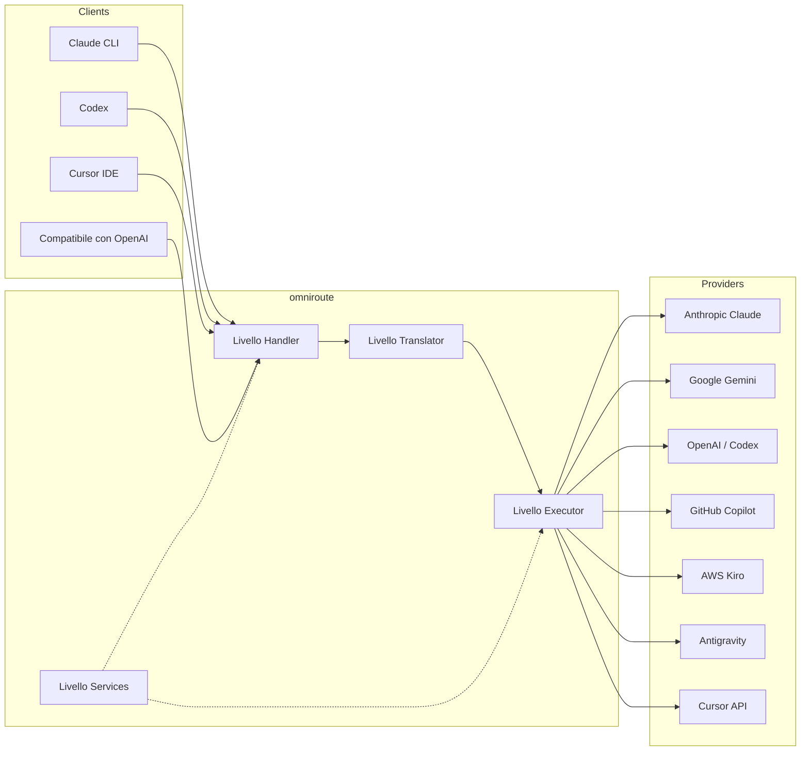

### Principio Fondamentale: Traduzione Hub-and-Spoke

Tutta la traduzione dei formati passa attraverso **il formato OpenAI come hub**:

```
Client Format → [OpenAI Hub] → Provider Format    (request)
Provider Format → [OpenAI Hub] → Client Format    (response)
```

Questo significa che servono solo **N traduttori** (uno per formato) invece di **N²** (ogni coppia).

---

## 3. Project Structure

```
omniroute/
├── open-sse/                  ← Core proxy library (portable, framework-agnostic)
│   ├── index.js               ← Main entry point, exports everything
│   ├── config/                ← Configuration & constants
│   ├── executors/             ← Provider-specific request execution
│   ├── handlers/              ← Request handling orchestration
│   ├── services/              ← Business logic (auth, models, fallback, usage)
│   ├── translator/            ← Format translation engine
│   │   ├── request/           ← Request translators (8 files)
│   │   ├── response/          ← Response translators (7 files)
│   │   └── helpers/           ← Shared translation utilities (6 files)
│   └── utils/                 ← Utility functions
├── src/                       ← Application layer (Express/Worker runtime)
│   ├── app/                   ← Web UI, API routes, middleware
│   ├── lib/                   ← Database, auth, and shared library code
│   ├── mitm/                  ← Man-in-the-middle proxy utilities
│   ├── models/                ← Database models
│   ├── shared/                ← Shared utilities (wrappers around open-sse)
│   ├── sse/                   ← SSE endpoint handlers
│   └── store/                 ← State management
├── data/                      ← Runtime data (credentials, logs)
│   └── provider-credentials.json   (external credentials override, gitignored)
└── tester/                    ← Test utilities
```

---

## 4. Module-by-Module Breakdown

### 4.1 Config (`open-sse/config/`)

La **sola fonte di verità** per tutta la configurazione dei fornitori.

| File                          | Scopo                                                                                                                                                                                                                                      |
| ----------------------------- | ------------------------------------------------------------------------------------------------------------------------------------------------------------------------------------------------------------------------------------------ |
| `constants.ts`                | Oggetto `PROVIDERS` con URL di base, credenziali OAuth (valori predefiniti), header e prompt di sistema predefiniti per ogni fornitore. Definisce inoltre `HTTP_STATUS`, `ERROR_TYPES`, `COOLDOWN_MS`, `BACKOFF_CONFIG` e `SKIP_PATTERNS`. |
| `credentialLoader.ts`         | Carica le credenziali esterne da `data/provider-credentials.json` e le unisce sopra i valori predefiniti hardcoded in `PROVIDERS`. Mantiene i segreti fuori dal controllo del codice sorgente preservando la retrocompatibilità.           |
| `providerModels.ts`           | Registro centrale dei modelli: mappa gli alias dei fornitori → ID dei modelli. Funzioni come `getModels()`, `getProviderByAlias()`.                                                                                                        |
| `codexInstructions.ts`        | Istruzioni di sistema iniettate nelle richieste di Codex (vincoli di modifica, regole della sandbox, policy di approvazione).                                                                                                              |
| `defaultThinkingSignature.ts` | Firme di "pensiero" predefinite per i modelli Claude e Gemini.                                                                                                                                                                             |
| `ollamaModels.ts`             | Definizione dello schema per i modelli Ollama locali (nome, dimensione, famiglia, quantizzazione).                                                                                                                                         |

#### Flusso di Caricamento delle Credenziali

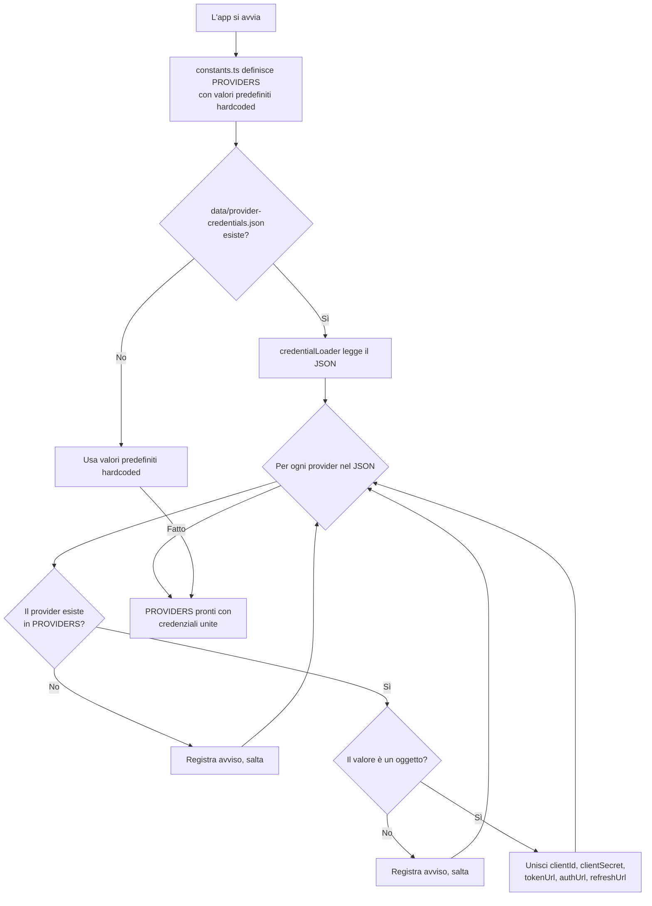

---

### 4.2 Executors (`open-sse/executors/`)

Gli executor incapsulano **la logica specifica del fornitore** usando il **Pattern Strategy**. Ogni executor sovrascrive i metodi della base secondo necessità.

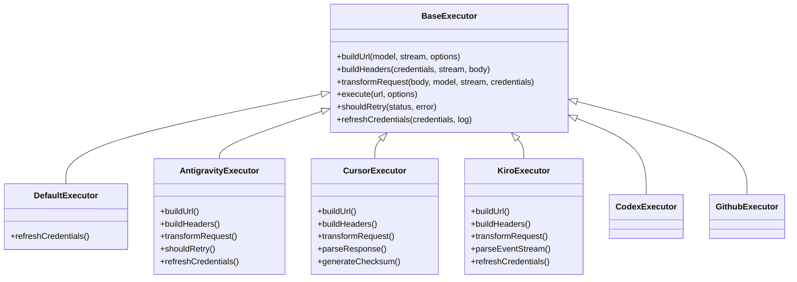

| Executor         | Fornitore                                  | Specializzazione Chiave                                                                                                            |
| ---------------- | ------------------------------------------ | ---------------------------------------------------------------------------------------------------------------------------------- |
| `base.ts`        | —                                          | Base astratta: costruzione URL, header, logica di retry, aggiornamento delle credenziali                                           |
| `default.ts`     | Claude, Gemini, OpenAI, GLM, Kimi, MiniMax | Aggiornamento token OAuth generico per i fornitori standardi                                                                       |
| `antigravity.ts` | Google Cloud Code                          | Generazione ID progetto/sessione, fallback multi-URL, parsing ad hoc del retry dai messaggi di errore ("reset after 2h7m23s")      |
| `cursor.ts`      | Cursor IDE                                 | **Il più complesso**: autenticazione con checksum SHA-256, codifica richiesta Protobuf, parsing binario EventStream → risposta SSE |
| `codex.ts`       | OpenAI Codex                               | Inietta le istruzioni di sistema, gestisce i livelli di thinking, rimuove i parametri non supportati                               |
| `github.ts`      | GitHub Copilot                             | Sistema token duale (GitHub OAuth + token Copilot), imitazione header VSCode                                                       |
| `kiro.ts`        | AWS CodeWhisperer                          | Parsing binario AWS EventStream, frame di eventi AMZN, stima dei token                                                             |
| `index.ts`       | —                                          | Factory: mappa il nome del fornitore → classe executor, con fallback predefinito                                                   |

---

### 4.3 Handlers (`open-sse/handlers/`)

Il **livello di orchestrazione** — coordina traduzione, esecuzione, streaming e gestione degli errori.

| File                  | Scopo                                                                                                                                                                                                                                                                       |
| --------------------- | --------------------------------------------------------------------------------------------------------------------------------------------------------------------------------------------------------------------------------------------------------------------------- |
| `chatCore.ts`         | **Orchestratore centrale** (~600 righe). Gestisce l'intero ciclo di vita della richiesta: rilevamento del formato → traduzione → dispatch dell'executor → risposta streaming/non-streaming → aggiornamento del token → gestione degli errori → registrazione dell'utilizzo. |
| `responsesHandler.ts` | Adattatore per le API di risposta di OpenAI: converte il formato Responses → Chat Completions → lo invia a `chatCore` → riconverte l'SSE nel formato Responses.                                                                                                             |
| `embeddings.ts`       | Gestore per la generazione di embedding: risolve il modello di embedding → fornitore, gestisce la richiesta all'API del fornitore, restituisce una risposta di embedding compatibile con OpenAI. Supporta 6+ fornitori.                                                     |
| `imageGeneration.ts`  | Gestore per la generazione di immagini: risolve il modello di immagini → fornitore, supporta le modalità compatibili con OpenAI, Gemini-image (Antigravity) e l'opzione (Nebius). Restituisce immagini base64 o URL.                                                        |

#### Ciclo di Vita della Richiesta (chatCore.ts)

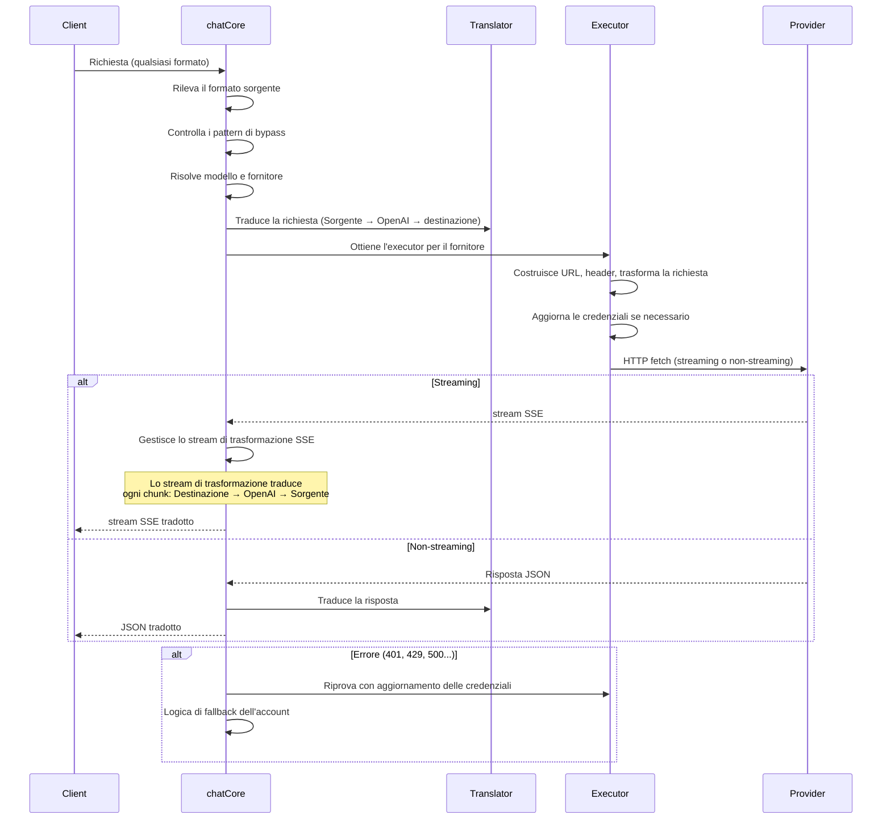

---

### 4.4 Services (`open-sse/services/`)

Logica di business che supporta gli handler e gli executor.

| File                 | Scopo                                                                                                                                                                                                                                                                                                                                                                                            |
| -------------------- | ------------------------------------------------------------------------------------------------------------------------------------------------------------------------------------------------------------------------------------------------------------------------------------------------------------------------------------------------------------------------------------------------ |
| `provider.ts`        | **Rilevamento del formato** (`detectFormat`): analizza la struttura del corpo della richiesta per identificare i formati Claude/OpenAI/Gemini/Antigravity/Responses (inclusa l'euristica `max_tokens` per Claude). Anche: costruzione URL, costruzione header, normalizzazione della configurazione di thinking. Supporta i fornitori dinamici `openai-compatible-*` e `anthropic-compatible-*`. |
| `model.ts`           | Parsing delle stringhe del modello (`claude/model-name` → `{provider: "claude", model: "model-name"}`), risoluzione degli alias con rilevamento delle collisioni, sanificazione dell'input (respinge path traversal/caratteri di controllo) e risoluzione delle informazioni sul modello con supporto dei getter di alias async.                                                                 |
| `accountFallback.ts` | Gestione dei limiti di frequenza: backoff esponenziale (1s → 2s → 4s → max 2min), gestione del cooldown degli account, classificazione degli errori (quali errori attivano il fallback e quali no).                                                                                                                                                                                              |
| `tokenRefresh.ts`    | Refresh dei token OAuth per **ogni fornitore**: Google (Gemini, Antigravity), Claude, Codex, Qwen, Qoder, GitHub (dual-token OAuth + Copilot), Kiro (AWS SSO OIDC + Social Auth). Include una cache di deduplicazione delle promise in-flight e un retry con backoff esponenziale.                                                                                                               |
| `combo.ts`           | **Modelli combo**: catene di modelli di fallback. Se il modello A fallisce con un errore idoneo al fallback, prova il modello B, poi C, ecc. Restituisce i codici di stato upstream effettivi.                                                                                                                                                                                                   |
| `usage.ts`           | Recupera i dati di quota/utilizzo dalle API dei fornitori (quote GitHub Copilot, quote dei modelli Antigravity, limiti di frequenza Codex, riepiloghi di utilizzo Kiro, impostazioni Claude).                                                                                                                                                                                                    |
| `accountSelector.ts` | Selezione intelligente degli account con algoritmo di punteggio: considera priorità, stato di salute, posizione round-robin e stato del cooldown per scegliere l'account ottimale per ogni richiesta.                                                                                                                                                                                            |
| `contextManager.ts`  | Gestione del ciclo di vita del contesto delle richieste: crea e tiene traccia degli oggetti di contesto per richiesta con metadati (ID richiesta, timestamp, informazioni sul fornitore) per debug e logging.                                                                                                                                                                                    |
| `ipFilter.ts`        | Controllo degli accessi basato su IP: supporta le modalità allowlist e blocklist. Valida l'IP del client rispetto alle regole configurate prima di elaborare le richieste API.                                                                                                                                                                                                                   |
| `sessionManager.ts`  | Tracciamento delle sessioni con fingerprint del client: tiene traccia delle sessioni attive usando identificatori del client sottoposti a hash, monitora i conteggi delle richieste e fornisce metriche di sessione.                                                                                                                                                                             |
| `signatureCache.ts`  | Cache di deduplicazione basata sulla firma della richiesta: previene le richieste duplicate memorizzando le firme recenti delle richieste e restituendo risposte in cache per richieste identiche entro una finestra temporale.                                                                                                                                                                  |
| `systemPrompt.ts`    | Iniezione globale di un system prompt: antepone o aggiunge un system prompt configurabile a tutte le richieste, con gestione della compatibilità per fornitore.                                                                                                                                                                                                                                  |
| `thinkingBudget.ts`  | Gestione del budget dei token di ragionamento: supporta le modalità passthrough, auto (rimozione della config di thinking), custom (budget fisso) e adattiva (scalata per complessità) per controllare i token di thinking/ragionamento.                                                                                                                                                         |
| `wildcardRouter.ts`  | Instradamento dei pattern wildcard dei modelli: risolve i pattern wildcard (es. `*/claude-*`) in coppie concrete fornitore/modello in base a disponibilità e priorità.                                                                                                                                                                                                                           |

#### Deduplicazione del Refresh dei Token

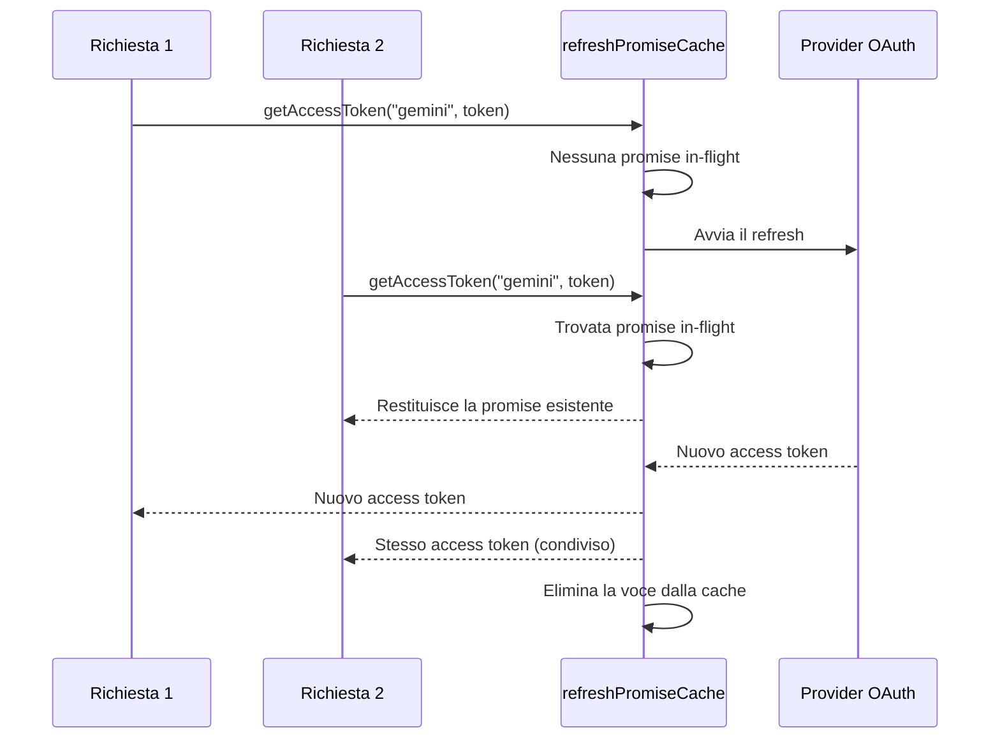

#### Macchina a Stati del Fallback dell'Account

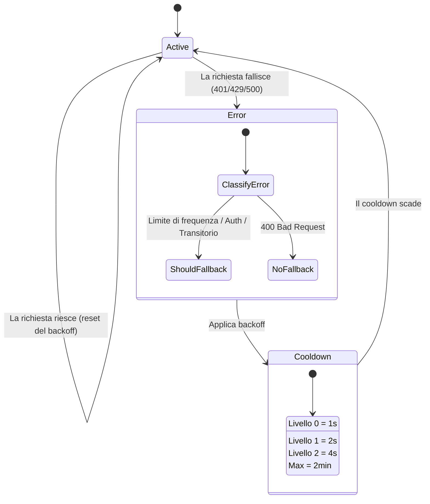

#### Catena di Modelli Combo

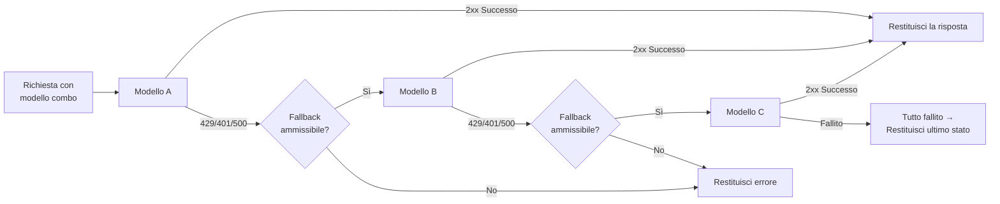

---

### 4.5 Translator (`open-sse/translator/`)

Il **motore di traduzione dei formati** che usa un sistema di plugin auto-registranti.

#### Architettura

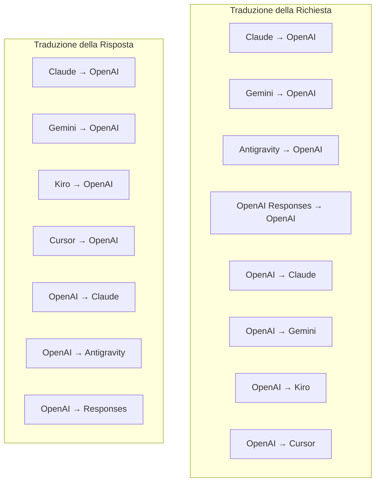

| Directory    | File         | Descrizione                                                                                                                                                                                                                                                                                   |
| ------------ | ------------ | --------------------------------------------------------------------------------------------------------------------------------------------------------------------------------------------------------------------------------------------------------------------------------------------- |
| `request/`   | 8 traduttori | Convertire i corpi delle richieste tra i formati. Ogni file si auto-registra tramite `register(from, to, fn)` all'import.                                                                                                                                                                     |
| `response/`  | 7 traduttori | Convertire i chunk di risposta in streaming tra i formati. Gestisce i tipi di evento SSE, i blocchi di thinking e i tool calls.                                                                                                                                                               |
| `helpers/`   | 6 helper     | Utilità condivise: `claudeHelper` (estrazione del system prompt, configurazione thinking), `geminiHelper` (mappatura parts/contents), `openaiHelper` (filtraggio del formato), `toolCallHelper` (generazione ID, iniezione della risposta mancante), `maxTokensHelper`, `responsesApiHelper`. |
| `index.ts`   | —            | Motore di traduzione: `translateRequest()`, `translateResponse()`, gestione dello stato, registry.                                                                                                                                                                                            |
| `formats.ts` | —            | Costanti dei formati: `OPENAI`, `CLAUDE`, `GEMINI`, `ANTIGRAVITY`, `KIRO`, `CURSOR`, `OPENAI_RESPONSES`.                                                                                                                                                                                      |

#### Progettazione Chiave: Plugin Auto-Registranti

```javascript
// Each translator file calls register() on import:
import { register } from "../index.js";
register("claude", "openai", translateClaudeToOpenAI);

// The index.js imports all translator files, triggering registration:
import "./request/claude-to-openai.js"; // ← self-registers
```

---

### 4.6 Utils (`open-sse/utils/`)

| File               | Scopo                                                                                                                                                                                                                                                                                                                                                         |
| ------------------ | ------------------------------------------------------------------------------------------------------------------------------------------------------------------------------------------------------------------------------------------------------------------------------------------------------------------------------------------------------------- |
| `error.ts`         | Costruzione delle risposte di errore (formato compatibile con OpenAI), parsing degli errori upstream, estrazione del tempo di retry di Antigravity dai messaggi di errore, streaming degli errori SSE.                                                                                                                                                        |
| `stream.ts`        | **Stream di trasformazione SSE** — la pipeline di streaming principale. Due modalità: `TRANSLATE` (traduzione completa del formato) e `PASSTHROUGH` (normalizza + estrai utilizzo). Gestisce il buffering dei chunk, la stima dell'utilizzo, il tracciamento della lunghezza del contenuto. Le istanze di encoder/decoder per-stream evitano stato condiviso. |
| `streamHelpers.ts` | Utilità SSE di basso livello: `parseSSELine` (tollerante agli spazi bianchi), `hasValuableContent` (filtra i chunk vuoti per OpenAI/Claude/Gemini), `fixInvalidId`, `formatSSE` (serializzazione SSE consapevole del formato con pulizia di `perf_metrics`).                                                                                                  |
| `usageTracking.ts` | Estrazione dell'utilizzo dei token da qualsiasi formato (Claude/OpenAI/Gemini/Responses), stima con rapporti caratteri-per-token separati per tool/messaggi, aggiunta di buffer (margine di sicurezza di 2000 token), filtraggio dei campi specifico del formato, logging su console con colori ANSI.                                                         |
| `requestLogger.ts` | Helper legacy di logging delle richieste basato su file, mantenuto per compatibilità. Le distribuzioni attuali dovrebbero preferire `APP_LOG_TO_FILE` per i log applicativi e la pipeline dei log delle chiamate per gli artefatti delle richieste persistite.                                                                                                |
| `bypassHandler.ts` | Intercetta pattern specifici di Claude CLI (estrazione del titolo, warmup, count) e restituisce risposte finte senza chiamare alcun fornitore. Supporta sia streaming che non-streaming. Intenzionalmente limitato all'ambito di Claude CLI.                                                                                                                  |
| `networkProxy.ts`  | Risolve l'URL del proxy di uscita per un determinato fornitore con precedenza: config specifica del fornitore → config globale → variabili d'ambiente (`HTTPS_PROXY`/`HTTP_PROXY`/`ALL_PROXY`). Supporta le esclusioni `NO_PROXY`. Memorizza la config in cache per 30s.                                                                                      |

#### Pipeline di Streaming SSE

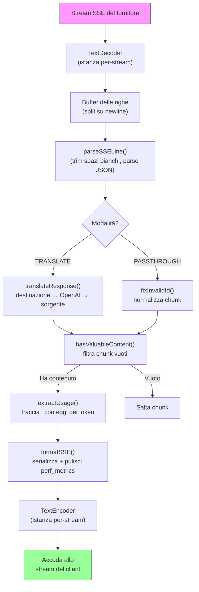

#### Struttura della Sessione del Request Logger

```
logs/
└── claude_gemini_claude-sonnet_20260208_143045/
    ├── 1_req_client.json      ← Raw client request
    ├── 2_req_source.json      ← After initial conversion
    ├── 3_req_openai.json      ← OpenAI intermediate format
    ├── 4_req_target.json      ← Final target format
    ├── 5_res_provider.txt     ← Provider SSE chunks (streaming)
    ├── 5_res_provider.json    ← Provider response (non-streaming)
    ├── 6_res_openai.txt       ← OpenAI intermediate chunks
    ├── 7_res_client.txt       ← Client-facing SSE chunks
    └── 6_error.json           ← Error details (if any)
```

---

### 4.7 Livello Applicativo (`src/`)

| Directory     | Scopo                                                                            |
| ------------- | -------------------------------------------------------------------------------- |
| `src/app/`    | Web UI, rotte API, middleware Express, handler di callback OAuth                 |
| `src/lib/`    | Accesso al database (`localDb.ts`, `usageDb.ts`), autenticazione, condiviso      |
| `src/mitm/`   | Utilità proxy man-in-the-middle per l'intercettazione del traffico dei fornitori |
| `src/models/` | Definizioni dei modelli del database                                             |
| `src/shared/` | Wrapper attorno alle funzioni di open-sse (provider, stream, error, ecc.)        |
| `src/sse/`    | Handler degli endpoint SSE che collegano la libreria open-sse alle rotte Express |
| `src/store/`  | Gestione dello stato dell'applicazione                                           |

#### Rotte API Degne di Nota

| Route                                         | Methods         | Scopo                                                                                            |
| --------------------------------------------- | --------------- | ------------------------------------------------------------------------------------------------ |
| `/api/provider-models`                        | GET/POST/DELETE | CRUD per i modelli personalizzati per fornitore                                                  |
| `/api/models/catalog`                         | GET             | Catalogo aggregato di tutti i modelli (chat, embedding, image, custom) raggruppati per fornitore |
| `/api/settings/proxy`                         | GET/PUT/DELETE  | Configurazione del proxy di uscita gerarchica (`global/providers/combos/keys`)                   |
| `/api/settings/proxy/test`                    | POST            | Valida la connettività del proxy e restituisce IP pubblico/latenza                               |
| `/v1/providers/[provider]/chat/completions`   | POST            | Chat completions dedicate per fornitore con validazione del modello                              |
| `/v1/providers/[provider]/embeddings`         | POST            | Embedding dedicati per fornitore con validazione del modello                                     |
| `/v1/providers/[provider]/images/generations` | POST            | Generazione di immagini dedicata per fornitore con validazione del modello                       |
| `/api/settings/ip-filter`                     | GET/PUT         | Gestione dell'allowlist/blocklist IP                                                             |
| `/api/settings/thinking-budget`               | GET/PUT         | Configurazione del budget dei token di ragionamento (passthrough/auto/custom/adaptive)           |
| `/api/settings/system-prompt`                 | GET/PUT         | Iniezione globale del system prompt per tutte le richieste                                       |
| `/api/sessions`                               | GET             | Tracciamento e metriche delle sessioni attive                                                    |
| `/api/rate-limits`                            | GET             | Stato del limite di frequenza per account                                                        |

---

## 5. Pattern di Progettazione Chiave

### 5.1 Traduzione Hub-and-Spoke

Tutti i formati traducono attraverso **il formato OpenAI come hub**. Aggiungere un nuovo fornitore richiede solo di scrivere **una coppia** di traduttori (da/verso OpenAI), non N coppie.

### 5.2 Pattern Strategy degli Executor

Ogni fornitore ha una classe executor dedicata che eredita da `BaseExecutor`. La factory in `executors/index.ts` seleziona quella giusta in fase di runtime.

### 5.3 Sistema di Plugin Auto-Registranti

I moduli del traduttore si registrano da soli all'import tramite `register()`. Aggiungere un nuovo traduttore significa semplicemente creare un file e importarlo.

### 5.4 Fallback degli Account con Backoff Esponenziale

Quando un fornitore restituisce 429/401/500, il sistema può passare all'account successivo, applicando cooldown esponenziali (1s → 2s → 4s → max 2min).

### 5.5 Catene di Modelli Combo

Un "combo" raggruppa più stringhe `provider/model`. Se il primo fallisce, il fallback passa automaticamente al successivo.

### 5.6 Traduzione di Streaming con Stato

La traduzione della risposta mantiene lo stato tra i chunk SSE (tracciamento dei blocchi di thinking, accumulo delle tool call, indicizzazione dei blocchi di contenuto) tramite il meccanismo `initState()`.

### 5.7 Buffer di Sicurezza per l'Utilizzo

Un buffer di 2000 token viene aggiunto all'utilizzo riportato per evitare che i client raggiungano i limiti della finestra di contesto a causa dell'overhead dei system prompt e della traduzione del formato.

---

## 6. Formati Supportati

| Formato                 | Direzione               | Identificatore     |
| ----------------------- | ----------------------- | ------------------ |
| OpenAI Chat Completions | sorgente + destinazione | `openai`           |
| OpenAI Responses API    | sorgente + destinazione | `openai-responses` |
| Anthropic Claude        | sorgente + destinazione | `claude`           |
| Google Gemini           | sorgente + destinazione | `gemini`           |
| Antigravity             | sorgente + destinazione | `antigravity`      |
| AWS Kiro                | solo destinazione       | `kiro`             |
| Cursor                  | solo destinazione       | `cursor`           |

---

## 7. Fornitori Supportati

| Fornitore                | Metodo di Auth         | Executor    | Note Chiave                                            |
| ------------------------ | ---------------------- | ----------- | ------------------------------------------------------ |
| Anthropic Claude         | API key o OAuth        | Default     | Usa l'header `x-api-key`                               |
| Google Gemini            | API key o OAuth        | Default     | Usa l'header `x-goog-api-key`                          |
| Antigravity              | OAuth                  | Antigravity | Fallback multi-URL, parsing del retry personalizzato   |
| OpenAI                   | API key                | Default     | Auth Bearer standard                                   |
| Codex                    | OAuth                  | Codex       | Inietta le istruzioni di sistema, gestisce il thinking |
| GitHub Copilot           | OAuth + token Copilot  | Github      | Doppio token, imitazione dello header di VSCode        |
| Kiro (AWS)               | AWS SSO OIDC o Social  | Kiro        | Parsing binario di EventStream                         |
| Cursor IDE               | Checksum auth          | Cursor      | Codifica Protobuf, checksum SHA-256                    |
| Qwen                     | OAuth                  | Default     | Auth standard                                          |
| Qoder                    | OAuth (Basic + Bearer) | Default     | Doppio header di autenticazione                        |
| OpenRouter               | API key                | Default     | Auth Bearer standard                                   |
| GLM, Kimi, MiniMax       | API key                | Default     | Compatibili con Claude, usano `x-api-key`              |
| `openai-compatible-*`    | API key                | Default     | Dinamico: qualsiasi endpoint compatibile con OpenAI    |
| `anthropic-compatible-*` | API key                | Default     | Dinamico: qualsiasi endpoint compatibile con Claude    |

---

## 8. Riepilogo del Flusso di Dati

### Richiesta in Streaming

```mermaid
flowchart LR
    A["Client"] --> B["detectFormat()"]
    B --> C["translateRequest()\nsorgente → OpenAI → destinazione"]
    C --> D["Executor\nbuildUrl + buildHeaders"]
    D --> E["fetch(providerURL)"]
    E --> F["createSSEStream()\nmodalità TRANSLATE"]
    F --> G["parseSSELine()"]
    G --> H["translateResponse()\ndestinazione → OpenAI → sorgente"]
    H --> I["extractUsage()\n+ addBuffer"]
    I --> J["formatSSE()"]
    J --> K["Il client riceve\nSSE tradotto"]
    K --> L["logUsage()\nsaveRequestUsage()"]
```

### Richiesta Non-Streaming

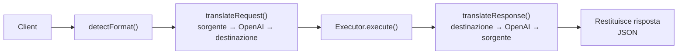

### Flusso di Bypass (Claude CLI)

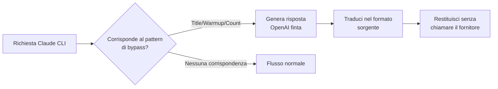
